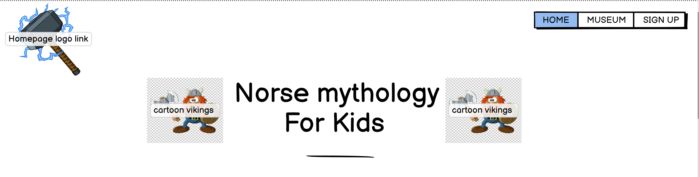
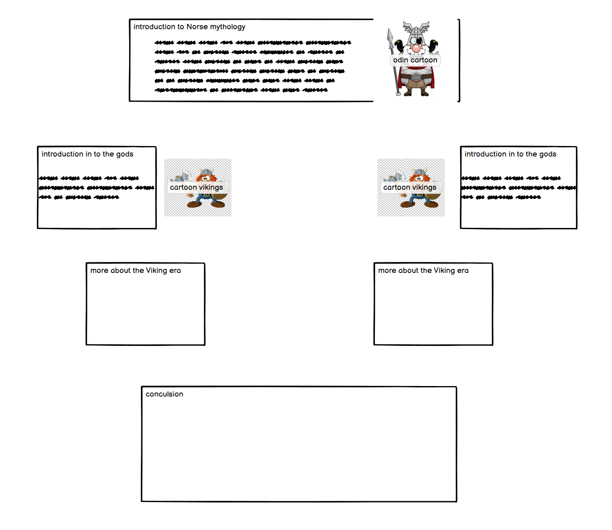
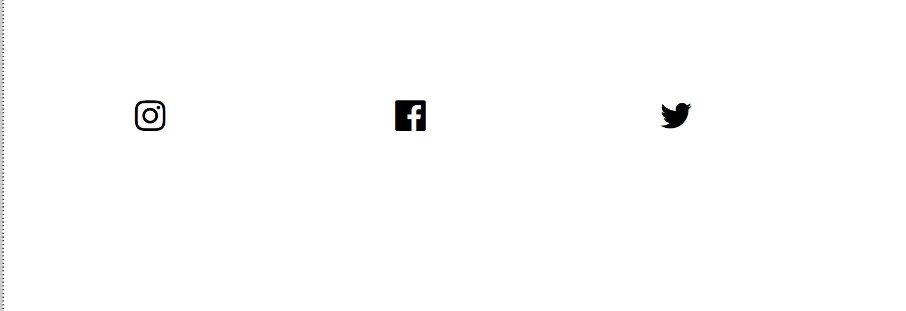
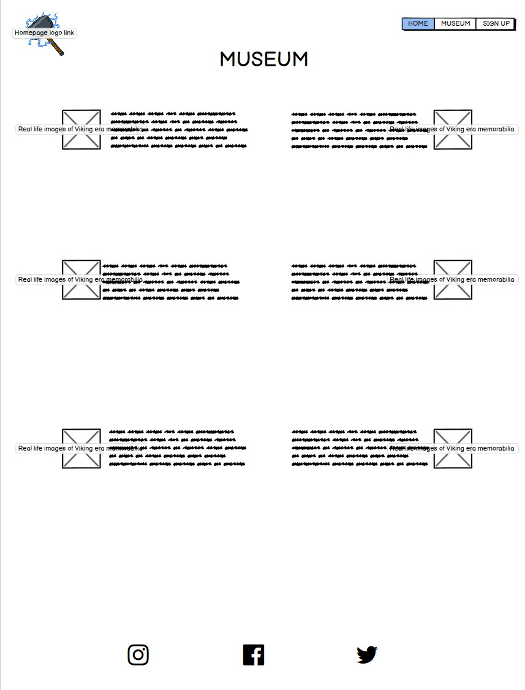
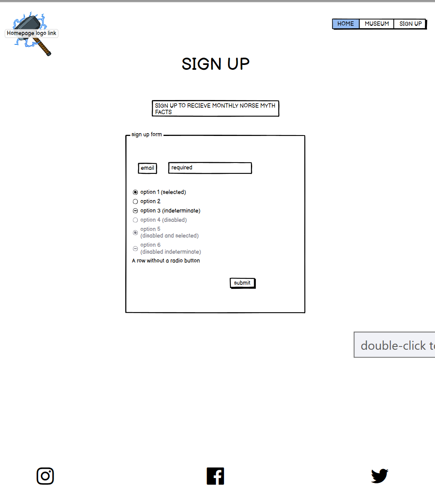
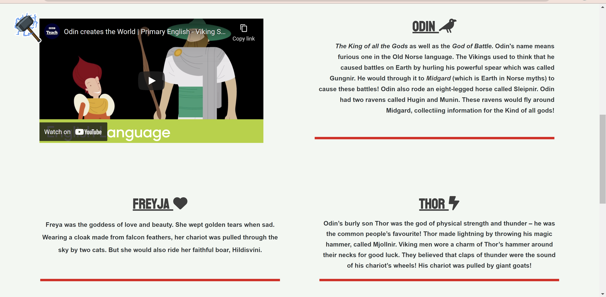
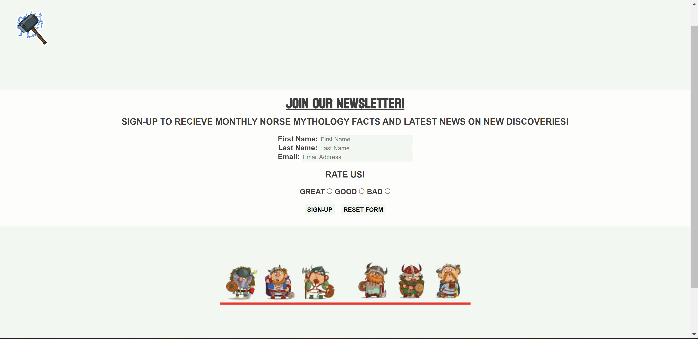

# **Norse Mythology For Kids!** 

## **Introduction:**

Norse Mythology for Kids is an educational insight into the era of Vikings and how their religious beliefs shaped their view of life. The purpose of this website is to provide a quick and fun introduction into the mythology of the Norse religion, it is to explain it in quick; factual paragraphs with the use of funny images to give a visualisation of the historic figures.

The sole purpose of this website is to provide a younger generation an easy to follow, interactive website where they can learn about Norse mythology. With the hopes of them wanting to further their knowledge with additional research. It is There to help 
them find an interest into the history of other cultures and how humanity once lived, fought and survived in such a dramatic era.

---

## **User Stories:**

* As a visiting user I would like to understand the content of the website.
* As a visiting user I would like to see a museum.
* As a visiting user I would like to sign up for a monthly newsletter.

---

## **Features:**

 ####  **Navigation Bar:**
   * This has all elements to be able to navagate across the website, such as a _**Logo**_ that is a *homepage link*, a _**Home**_ button, _**Museum**_ button and a _**Sign-up**_ button. This is to allow the user easy access to the website as it is in the exact same place across all pages.

 #### **Landing Page Images:**
 * This will provide the user a good introduction into the website by using bright and striking image of cartoon Vikings
 
 #### **Fun Facts Section:** 
 * This section includes all the necessary information for user to understand the concepts of Norse mythology.

 #### **Footer:**
 * The Footer will include the important social media links for the user to explore the other pages, clicking the icon will make another window.

 #### **Museum Page**
 * This page will provide the user facts about items found from the Viking era and also the Real-life images of the artifacts that were found!

 #### **Sign-up Page**
 * The purpose of this page is to allow the user to be able to sign up to a monthly newsletter.

 ---

 ## **Future Features**
 * An interactive questionnaire.
 * Design your own Viking page.
 * Places to visit page.

 ---

## **Typography and Colour-Scheme**
* Typography:
  * Arela-round
  * Kouenl
  * Comic-sans
* Colour-Scheme:
  * Mint Cream-F2F7F2
  * Dark grey- 3E3E3E
  * Rich red -E11218
 

---

## **Wireframes:**
**Header: Navigation bar, logo, Page Title with images:**
---

**Landing page Main section:** 
---
 

**Footer:**
---

**Museum page:**
---
 

**Sign-up page**
---

## **Technology**

 * CSS
 * HTML
 * Gitpod
 * Github

--- 

# **Testing:** 

## **HTML Vaildator** 
NO errors or bugs found within the code. Validated on Official W3C Validator - [CLICK HERE](https://validator.w3.org/nu/?doc=https%3A%2F%2Fkhanlewis.github.io%2FNorse-Mythology-For-Kids%2F)   

## **CSS Validator**
NO errors found within CSS code. Validated by  Official Jigsaw - [CLICK HERE](https://jigsaw.w3.org/css-validator/validator?uri=https%3A%2F%2Fkhanlewis.github.io%2FNorse-Mythology-For-Kids%2F&profile=css3svg&usermedium=all&warning=1&vextwarning=&lang=en)

---
# **Test cases**
* "As a visiting user I would like to understand the content of the website":
  * 
  * 
  * 

* "As a visiting user I would like to see a museum":
  * 
  * 

* "As a visiting user I would like to sign up for a monthly newsletter":
  * 
---

# **Fixed Bugs**

* Homepage image wouldn't sit behind header.

---

# **Supported screen sizes**

* Large desktop screens and mobile devices.
---
# **Deployment**

* This site was deployed to Github pages. The steps I took are shown below:
  * load up your repository within Github.
  * At the top of the repository (not the page) select settings.
  * Once on settings navigate down to the pages tab.
  * Click on the branch option and select "main", then click save.
  * Wait for a couple of minutes, and you should see a message saying your site is live with the URL.

--- 
## **Live website URL**
https://khanlewis.github.io/Norse-Mythology-For-Kids/
