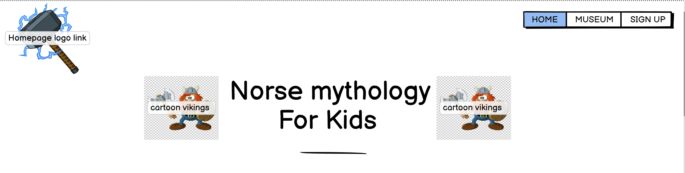
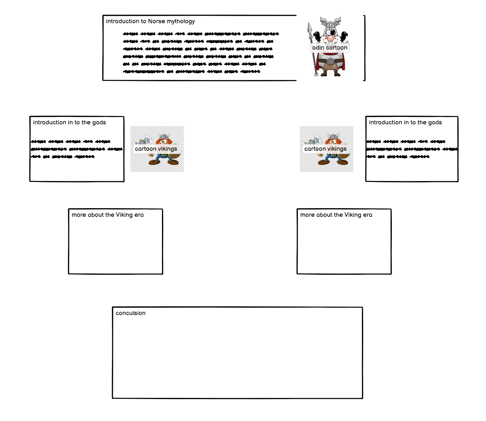
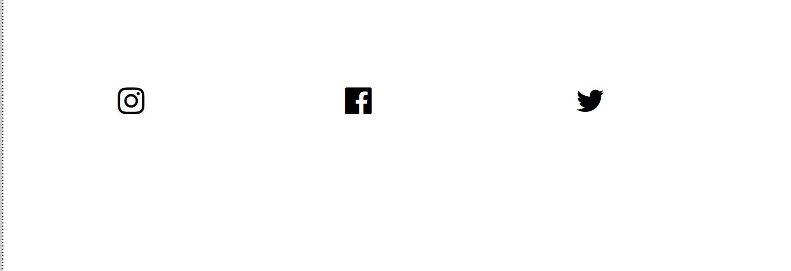
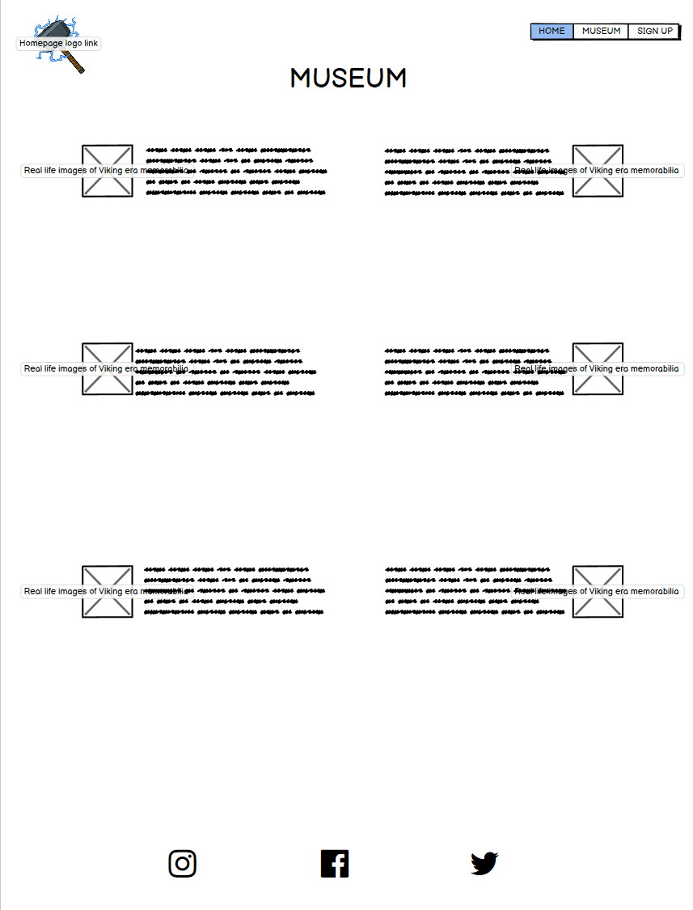
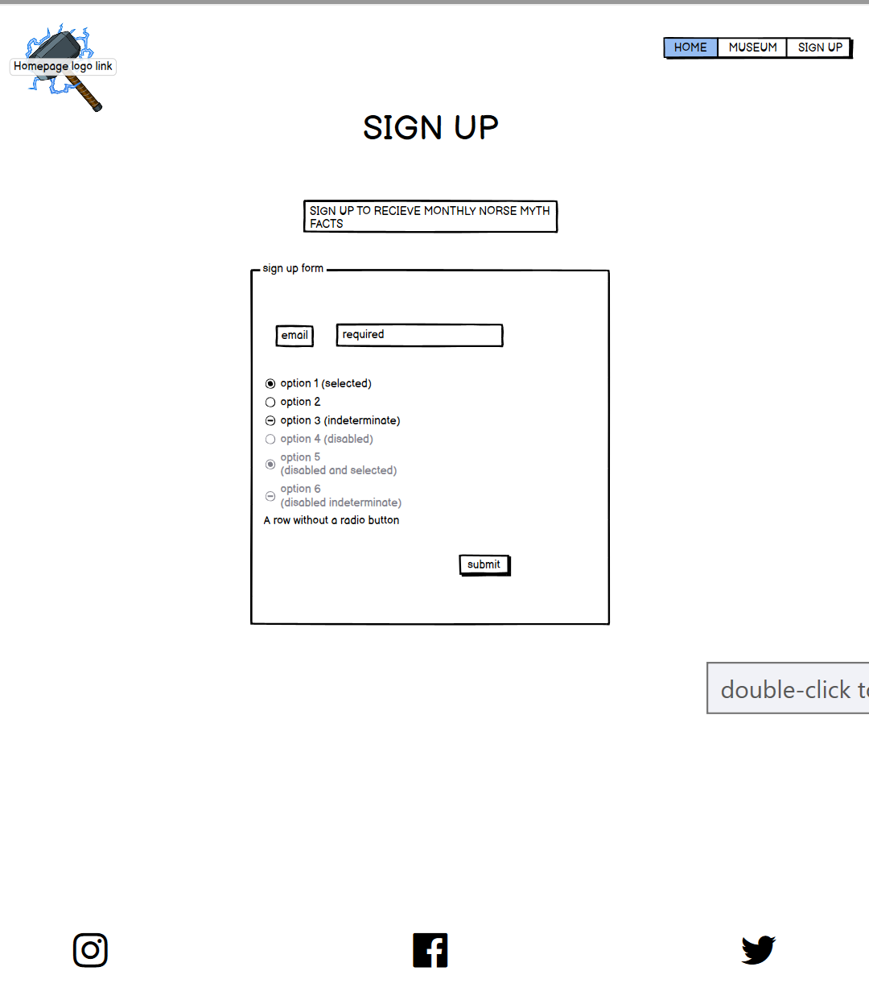
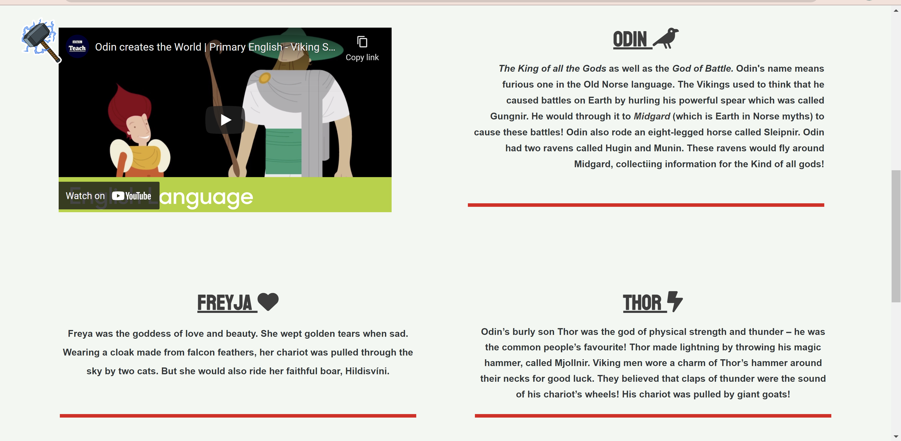

# **Norse Mythology For Kids!** 

## **Introduction:**

Norse Mythology for Kids is an educational insight into the era of Vikings and how their religious beliefs shaped their view of life. The purpose of this website is to provide a quick and fun introduction into the mythology of the Norse religion, it is to explain it in quick; factual paragraphs with the use of funny images to give a visualisation of the historic figures.

The sole purpose of this website is to provide a younger generation an easy to follow, interactive website where they can learn about Norse mythology. With the hopes of them wanting to further their knowledge with additional research. It is There to help 
them find an interest into the history of other cultures and how humanity once lived, fought and survived in such a dramatic era.

---

## **User Stories:**

* As a visiting user I would like to understand the content of the website.
* As a visiting user I would like to see a museum.
* As a visiting user I would like to sign up for a monthly newsletter.

---

## **Features:**

 ####  **Navigation Bar:**
   * This has all elements to be able to navagate across the website, such as a _**Logo**_ that is a *homepage link*, a _**Home**_ button, _**Museum**_ button and a _**Sign-up**_ button. This is to allow the user easy access to the website as it is in the exact same place across all pages.

 #### **Landing Page Images:**
 * This will provide the user a good introduction into the website by using bright and striking image of cartoon Vikings
 
 #### **Fun Facts Section:** 
 * This section includes all the necessary information for user to understand the concepts of Norse mythology.

 #### **Footer:**
 * The Footer will include the important social media links for the user to explore the other pages, clicking the icon will make another window.

 #### **Museum Page**
 * This page will provide the user facts about items found from the Viking era and also the Real-life images of the artifacts that were found!

 #### **Sign-up Page**
 * The purpose of this page is to allow the user to be able to sign up to a monthly newsletter.

 ---

 ## **Future Features**
 * An interactive questionnaire.
 * Design your own Viking page.
 * Places to visit page.

 ---

## **Typography and Colour-Scheme**
* Typography:
  * Arela-round
  * Kouenl
  * Comic-sans
* Colour-Scheme:
  * Mint Cream-F2F7F2
  * Dark grey- 3E3E3E
  * Rich red -E11218
 

---

## **Wireframes:**
**Header: Navigation bar, logo, Page Title with images:**
---

**Landing page Main section:** 
---
 

**Footer:**
---

**Museum page:**
---
 

**Sign-up page**
---

## **Technology**

 * CSS- I used css to add style to my HTML code i achieved this with a style.css file and a link within the head of the document.
 * HTML- I used HTML to add content to my webpages I also used html to structure my webpages.
 * Gitpod-I used Gitpod to load all my repositories and run my coding platform.
 * Github- I used Github to store all my repository data and to upload my webpage to the internet.

--- 

# **Testing:** 

## **HTML Vaildator** 
NO errors or bugs found within the code. Validated on Official W3C Validator - [CLICK HERE](https://validator.w3.org/nu/?doc=https%3A%2F%2Fkhanlewis.github.io%2FNorse-Mythology-For-Kids%2F)   

## **CSS Validator**
NO errors found within CSS code. Validated by  Official Jigsaw - [CLICK HERE](https://jigsaw.w3.org/css-validator/validator?uri=https%3A%2F%2Fkhanlewis.github.io%2FNorse-Mythology-For-Kids%2F&profile=css3svg&usermedium=all&warning=1&vextwarning=&lang=en)

---
# **Test cases**

* "The user will notice the header containing the nav and homepage elements also the hammer that take you to the top of each page. Introduction paragraph with a heading, when the user scrolls down the user will notice a video that is playable at the right of video the user will see a paragraph explaining the concept of Viking god:Odin within each paragraph the user will notice clickable link that redirect you to another page explain the highlighted words. Underneath that the user will see two more paragraphs with heading off Thor and Freyja. Lastly the user will notice the footer containing social media clickable icons.."

  * 
  * 
  * 

* "The user will notice the header and navigation buttons, below that the user will see a page heading that says “Museum” with two icons either side. When the user scrolls down the user will notice three images with paragraphs either side explaining what is in the images. Each paragraph will contain headers, further down the user will see the footer which contains clickable social media icons.":
  * 
  * 

* "When the user visits this page via the navigation bar and clicking on the sign-up button. They will notice two headings and a form they are able to fill out. This form consists off a name and surname input box that is required for the from to be able to be submitted. Underneath is an email box that is also required for the user to enter a valid email address. After completing the first section of the form the user will a heading saying, “Rate us!” after that they will notice clickable buttons with the labels Great, Good, Bad. Lastly there is two submit buttons that change colour when the user hover their mouse over the top of them. One button says “reset form” which will erase the forms contents. The other button will redirect the user to another page within the website that confirms that the user ahs been signed up. On this page the user will see the header with all the nav element so they can return to other pages":
  * 
---

# **Fixed Bugs**

* Homepage image wouldn't sit behind header.
* Youtube Iframe wasn't loading.
* Paragraphs overflowing on smaller screen sizes.

---

# **Supported screen sizes**

* I have tested the screen sizes from 390px to 1500px using google's deveolper tools the website is fully responsive in between these sizes.
---
# **Deployment**

## Github:

* This site was deployed to Github pages. The steps I took are shown below:
  * load up your repository within Github.
  * At the top of the repository (not the page) select settings.
  * Once on settings navigate down to the pages tab.
  * Click on the branch option and select "main", then click save.
  * Wait for a couple of minutes, and you should see a message saying your site is live with the URL.

## Gitpod:
* This site was also viewed via a browser using Gitpod, these are the steps I took:
  * open your chosen repository within github.
  * At the top of the repository press the gitpod button.
  * Once loaded in to gitpod within the terminal type "python3 -m http.server"
  * wait for the pop up in the bottom right hand corner of Gitpod.
  * click the open browser option and it will redirect you to your webpage.

--- 
## **Live website URL**
https://khanlewis.github.io/Norse-Mythology-For-Kids/
